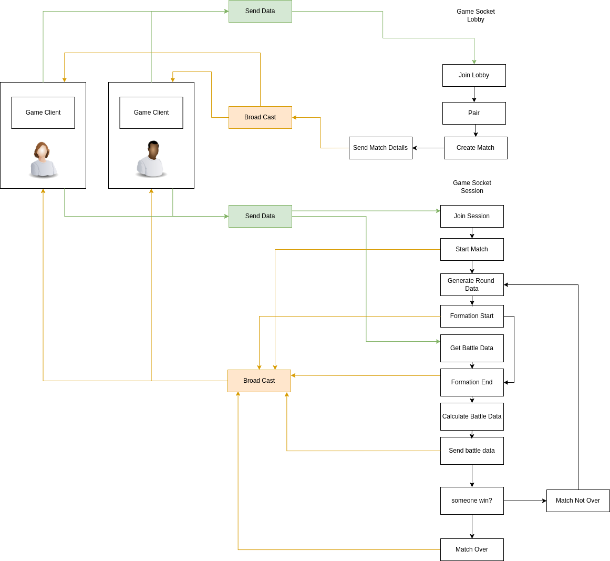

# Ija Orisha Server

This is the socket server for ija-orisha built with node.js it manage the following:

* Lobby
* Game session
* Game backend

it deployed on aws eleasticbeanstack

## Architectural Design



## Local setup

1. Clone the repo
2. run ```npm install```
3. run ```npm run dev```

The server would start and is ready for managing game session

## Deployment setup

aws config sso

eb deploy --profile your-profile
